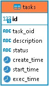

# Task Scheduler

## Description
Тестовое задание на разработчика python в компанию Dr.Web
```
Требования к прототипу:

- Реализовать API-endpoint, при обращении к которому создается задача, которая добавляется в очередь, и пользователю возвращается номер задачи.

- Второй API-endpoint возвращает статус задачи в формате json {'status': '...', 'create_time": '...', 'start_time': '...', 'time_to_execute': '...'}.

Статусы:

- In Queue -- задача ждёт своей очереди на выполнение;

- Run -- произошел запуск задачи;

- Completed -- задача выполнена.

Выполнение задачи представляет собой заглушку в виде python-кода:

`time.sleep(random.randint(0,10))`

Обратите внимание:

- Можно создавать множество задач, но выполняться одновременно должно не более 2 (двух);

- Результаты записать в локальную БД с полями: id (первичный ключ, номер поставленной задачи), create_time (время создания задачи), start_time (время старта задачи), exec_time (время выполнения задачи);

- Нельзя использовать celery/dramariq/taskiq и другие готовые фреймворки для работы с очередями задач;

- При написании стоит использовать python>=3.7, БД на свое усмотрение, любой веб-фреймворк (желательно асинхронный).
```

## Явные плюсы проекта

- :trident: Чистая архитектура
- :book: Приложение автоматически разворачивается в docker-compose
- :cd: Есть Makefile (чтобы развернуть тестовый стенд необходимо ввести всего лишь одну команду)
- :card_file_box: Великолепное ReadME

## Дополнительные фишки
- Реализованы паттерны проектирования для взаймодействия с БД - Unit of work, Repository
- Реализован паттерн Mediator для корректного взаймодействия между командами и эвентами
- Код соответствует принципу SOLID, особенно разделение интерфейсов и инверсия зависимостей
- Для иньекции зависимостей присутствует отдельный кэширующийся контейнер для того, чтобы не плодить логику в views

## Url для навигации
```http://localhost:8000/api/docs - Swagger```

## HOWTO

- Запускать с помощью команды `make all`
- логи uvicorn `make app-logs`

## Схема Task в Базе данных

